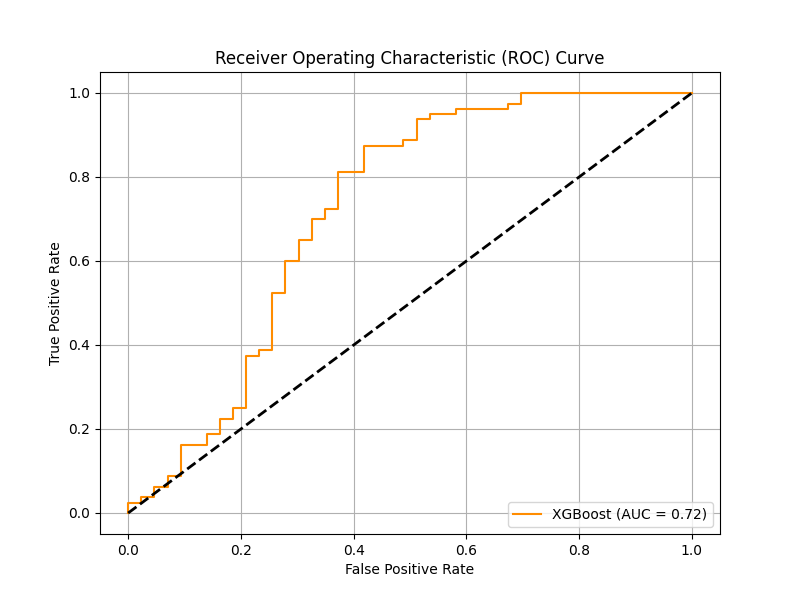

# 💳 Credit Risk Analysis & Prediction Dashboard

This project predicts loan approvals through **Credit Risk Analysis** using **Python (Machine Learning, Pandas)** and an **interactive Power BI dashboard**.

It covers the complete lifecycle:  
➡️ Data cleaning →  
➡️ Feature engineering →  
➡️ Model building →  
➡️ Dashboard creation.

---

## 🚀 Project Highlights:
- Predicts **loan approvals** based on applicant details and financial data.
- Includes:
  - Python Jupyter Notebook for data analysis & ML modeling.
  - Power BI Dashboard with KPI cards, slicers, and interactive visuals.
  - Cleaned datasets ready for use.
  - Dashboard screenshots for easy preview.

---

## 🔧 Tools & Technologies:
- Python:
  - Pandas, NumPy, Scikit-learn
  - Seaborn & Matplotlib
- Power BI (Data Visualization & Dashboard)
- Jupyter Notebook (for ML workflow)

---
## 📊 Model Performance

| Metric            | Score |
|-------------------|-------|
| ROC-AUC Score     | 0.72  |
| Model Used        | XGBoost Classifier |

#### 🔶 ROC Curve:

The ROC Curve above demonstrates the trade-off between True Positive Rate and False Positive Rate for the credit risk classification model.  
AUC Score of **0.72** suggests that the model has moderate capability to distinguish between risky and non-risky applicants.

---

> ✅ ROC-AUC Score ranges:
> - 0.5 → No Skill  
> - 0.7–0.8 → Acceptable  
> - 0.8–0.9 → Excellent  
> - 0.9+ → Outstanding  

---

### 📌 Notes:
- Model trained on the given dataset with feature engineering & preprocessing.
- XGBoost Classifier outperformed Logistic Regression based on ROC-AUC.

---

## 📈 Key Visualizations:
- KPI Cards (Total Loans, Average Income, Total Loan Amount)
- Donut Charts (Loan Status Distribution)
- Treemap (Property Area & Education)
- Scatter Plot (Income vs Loan Term)
- Histogram of Loan Amount Distribution
- Applicants by Property Area (Bar Chart)
- Slicers for Loan Status, Property Area, and more

---

## 💡 Key Insights:
- **Credit History** and **Applicant Income** significantly impact loan approvals.
- **Semiurban areas** show higher loan approval rates.
- **Graduate applicants** tend to get more approvals in specific areas.

---

## 📥 How to Run:
1. Open `notebooks/Credit_Risk_Analysis.ipynb` in Jupyter Notebook.
2. Run cells step-by-step (requires Python 3.x + required libraries).
3. Power BI Dashboard (`dashboard/Credit_Risk_Dashboard.pbix`) can be opened via Power BI Desktop.

---

## ✅ Author:
Priti Parmeshwar 

## ⭐ Star this repo if it helped you learn something new!
